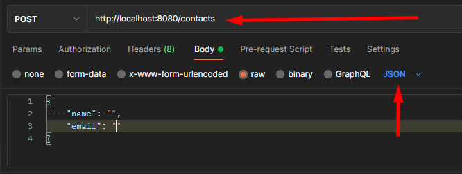

🔐API REST
- API REST feita para aprendizado.


# Descrição
Como input, temos:

- nome
- email




Exemplo:

```c#
{
    "name": "",
    "email": ""
}
```
> **_Nota:_**  Como estou usando o @valid, sendo proposital, não é possível criar um usuario sem "email" ou sem "nome".

## O projeto contem:

####Dependencias usadas:
- Spring web
- Spring Data JPA
- H2 Database
- Validation
- Spring Boot DevTools

####Configuração do pacote
- Maven Project
- Language: Kotlin
- Spring Boot - 2.4.12
- Packaging - Jar
- Java - 8


## Requisitos

[SDK Java 8] (https://www.oracle.com/java/technologies/javase-jdk8-downloads.html
[IntelliJ Community] (https://www.jetbrains.com/pt-br/idea/download/#section=windows)


## Tecnologias e ferramentas usadas
- [Java 8](https://www.oracle.com/java/technologies/javase-jdk8-downloads.html)
- [Java Spring Boot](https://spring.io/projects/spring-boot)
- [Postman](https://www.postman.com/downloads)


## Observações

O projeto é bem simples, com o intuito de aprender mais como se fazer uma api rest com kotlin e spring boot.

> **_Nota:_**  O projeto está sendo rodado no Intellij na http://localhost:8080/ - @GetMapping("/")

##ATENÇÃO: 
* Essa versao, caso queria acessar o banco H2, no intellij o JDBC URL é gerado na hora, sendo assim, você copia e cola para acessa-lo.
